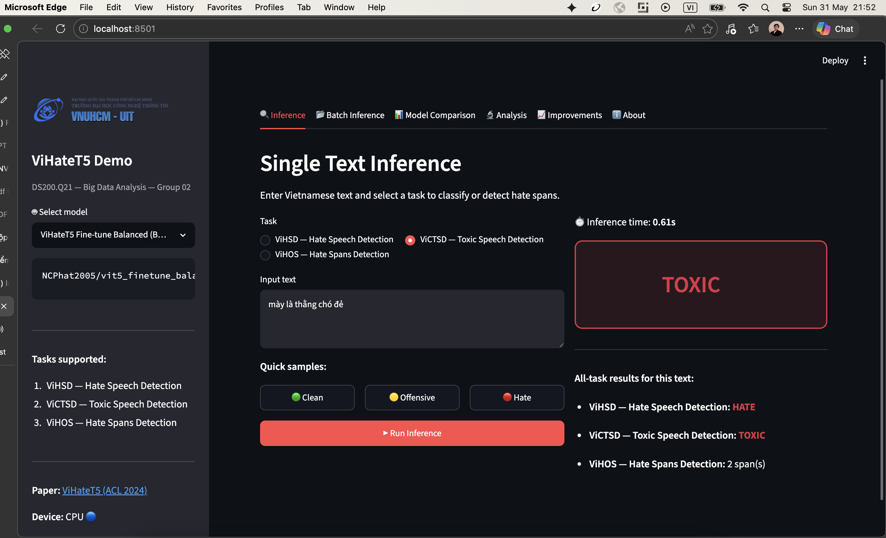

<p align="center">
  <a href="https://www.uit.edu.vn/" title="University of Information Technology" style="border: none;">
    
  </a>
</p>

<h1 align="center"><b>DS200.Q21 - Big Data Analysis</b></h1>

<p align="center">
  
  
  
  
  
  
</p>

# **DS200.Q21 Course Project (Group 02): Reimplementation and Improvement of ViHateT5 for Vietnamese Hate Speech Detection**

> **Based on paper:** Luan Thanh Nguyen, *"[ViHateT5: Enhancing Hate Speech Detection in Vietnamese With a Unified Text-to-Text Transformer Model](https://aclanthology.org/2024.findings-acl.355.pdf)"*, Findings of ACL 2024, pp. 5948–5961.
>
> This repository contains the reimplementation and extension of **ViHateT5** (ACL 2024 Findings), a unified text-to-text framework for Vietnamese hate speech detection. Developed for the course **DS200.Q21 – Big Data Analysis** at the University of Information Technology (UIT – VNU-HCM).
>
> The project covers three main pipelines: **continual pre-training** of T5 with Span Corruption on domain-specific data, **multi-task Seq2Seq fine-tuning** for unified multi-dataset classification, and **BERT-based encoder classification** as baselines. An **auto-labeling pipeline** using ViSoBERT was developed to label 10M+ samples from the VOZ-HSD dataset, enabling large-scale domain-specific pre-training.
>
> All trained models and datasets are hosted on HuggingFace: [DS200.Q21 Course Project - Big Data Analysis - Group 2](https://huggingface.co/collections/NCPhat2005/ds200q21-big-data-analysis-group-2).

---

<div align="center">
  <h2 align="center"> Thumbnail </h2>
  

  <h2 align="center"> Demo Webapp </h2>
  


</div>


---

## **Team Information - Group 2**
| No. | Student ID | Full Name | Class Order | Role | Github | Email |
|----:|:----------:|-----------|:---:|------|--------|-------|
| 1 | 23521143 | Phat Cong Nguyen | 45 | Leader | [paht2005](https://github.com/paht2005) | 23521143@gm.uit.edu.vn |
| 2 | 23520032 | An Thanh Hoang Truong | 3 | Member | [awnpvng](https://github.com/awnpvng) (primary account) / [Awnpz](https://github.com/Awnpz) (secondary account)  | 23520032@gm.uit.edu.vn |
| 3 | 23520213 | Cuong Viet Vu | 9 | Member | [Kun05-AI](https://github.com/Kun05-AI) | 23520213@gm.uit.edu.vn |

---

## **Table of Contents**
- [Course Requirements Fulfillment](#course-requirements-fulfillment)
- [Features](#features)
- [Datasets](#datasets)
- [Trained Models & Artifacts](#trained-models--artifacts)
- [Repository Structure](#repository-structure)
- [Methodology](#methodology)
- [Installation](#installation)
- [Usage](#usage)
- [Results](#results)
- [Limitations & Future Work](#limitations--future-work)
- [Citation](#citation)
- [References](#references)
- [License](#license)

---

## **Course Requirements Fulfillment**

This project addresses all four final project requirements for DS200.Q21:

| Req. | Requirement | How It Is Addressed |
|:----:|:------------|:--------------------|
| 01 | Understand the algorithms and AI models used for data analysis. | We study and document all core algorithms: T5's Span Corruption pre-training objective, Seq2Seq text-to-text formulation with task-specific prefixes, BERT-based encoder classification with fine-tuning, and the auto-labeling pipeline using ViSoBERT. See [Methodology](#methodology). |
| 02 | Design the code and reimplement the paper. | Full reimplementation of ViHateT5 paper (ACL 2024): pre-training pipeline ([`src/pre_train_t5.py`](src/pre_train_t5.py)), multi-task T5 fine-tuning ([`src/train_t5.py`](src/train_t5.py)), 8 BERT-based baselines ([`src/train_bert.py`](src/train_bert.py)), and evaluation ([`src/evaluate.py`](src/evaluate.py)). Results reproduced in [Results](#results). |
| 03 | Evaluate strengths and weaknesses of the method and related methods. | Comprehensive benchmarking across 8 BERT-based and 3 T5-based models. Analysis of pre-training impact (200K balanced vs. 100K hate-only). Identified weaknesses: data-centric only, minority class struggle, auto-labeling bias propagation. See [Results](#results) and [Limitations](#limitations--future-work). |
| 04 | Propose improved solutions, algorithms, or models. | **Data-Centric Improvement**: Auto-labeling pipeline ([`src/label_dataset.py`](src/label_dataset.py)) using ViSoBERT to label 10M+ VOZ-HSD samples (97.5% agreement), then continual domain-specific pre-training. **Model-Centric Improvements**: (1) Focal Loss ([`src/focal_loss.py`](src/focal_loss.py)) — Macro F1 improved from 0.5198→**0.7478** on ViHSD; (2) Data Augmentation ([`src/augment.py`](src/augment.py)) — Vietnamese synonym replacement & EDA for minority classes; (3) Model Ensemble ([`src/ensemble.py`](src/ensemble.py)) — weighted/majority voting combining T5 + BERT models; (4) Error Analysis ([`src/error_analysis.py`](src/error_analysis.py)) — confusion matrices, bootstrap CI, failure case studies. See [Methodology](#methodology) and [Training with Focal Loss](#training-with-focal-loss). |

---

## **Features**
- **Unified Text-to-Text Classification:** Handles 3 Vietnamese hate speech tasks (ViHSD, ViCTSD, ViHOS) within a single T5 model using task-specific prefixes.
- **Domain-Specific Pre-training:** Continual pre-training with T5's Span Corruption objective on 200K+ auto-labeled Vietnamese forum comments.
- **Auto-Labeling Pipeline:** ViSoBERT-based labeling of 10M+ VOZ-HSD samples with 97.5% agreement with manual annotations.
- **Focal Loss Training:** Addresses class imbalance by down-weighting easy examples, boosting Macro F1 from 0.5198 to **0.7478** on ViHSD.
- **Model Ensemble:** Combines multiple models (T5 + BERT) via weighted/majority voting for robust predictions.
- **Data Augmentation:** Vietnamese-specific synonym replacement, random operations, and back-translation for minority class oversampling.
- **Error Analysis:** Confusion matrices, per-class F1 breakdown, bootstrap confidence intervals, and failure case analysis.
- **Multi-Model Benchmarking:** Comparison of 8 BERT-based encoders and 3 T5-based generative models.
- **Reproducible Training:** Shell scripts with configurable CLI arguments for all training stages.
- **Interactive Demo:** Streamlit web app, FastAPI web app, and Jupyter notebook for real-time inference on all three tasks.

---

## **Datasets**

| Dataset | Type | Description |
| :--- | :--- | :--- |
| **ViHSD** | Multi-class | 3 labels: CLEAN, OFFENSIVE, HATE |
| **ViCTSD** | Binary | Toxic speech detection (TOXIC / NONE) |
| **ViHOS** | Hate Spans | Character-level hate span detection |
| **VOZ-HSD** | Binary | Large-scale auto-labeled dataset (10M+ samples from VOZ forum) |
| **Custom HF** | Any | Any HuggingFace dataset (auto-detected columns) |

All datasets are loaded automatically from HuggingFace or local files via `data_loader.py`.

---

## **Trained Models & Artifacts**

> **Full collection**: All models and datasets are hosted at [DS200.Q21 - Big Data Analysis - Group 2](https://huggingface.co/collections/NCPhat2005/ds200q21-big-data-analysis-group-2) on HuggingFace.

Key resources developed in this project:

* **Reimplemented ViHateT5**: [vihatet5_reimpl](https://huggingface.co/NCPhat2005/vihatet5_reimpl) — Full reimplementation of the ViHateT5 model (T5ForConditionalGeneration, vit5-base architecture, 12 layers, d_model=768). Fine-tuned on all three downstream hate speech detection tasks.
* **Labeling Model**: [visobert_labeling](https://huggingface.co/NCPhat2005/visobert_labeling) — ViSoBERT-based model used for auto-labeling large-scale datasets.
* **Labeled Dataset**: [voz_hsd_labeled](https://huggingface.co/datasets/NCPhat2005/voz_hsd_labeled) — VOZ dataset with 12M+ rows, fully processed and labeled.
* **Fine-tuned Model (3-datasets, Hate-Only)**: [vit5_finetune_hate_only](https://huggingface.co/NCPhat2005/vit5_finetune_hate_only) — ViT5-base fine-tuned jointly on ViHSD, ViCTSD, ViHOS from the "hate-only" pre-trained checkpoint.
* **Fine-tuned Model (3-datasets, Balanced)**: [vit5_finetune_balanced](https://huggingface.co/NCPhat2005/vit5_finetune_balanced) — ViT5-base fine-tuned jointly on 3 datasets from the "balanced" pre-trained checkpoint.
* **Fine-tuned Model (Multi-dataset version)**: [vit5_finetune_multi](https://huggingface.co/NCPhat2005/vit5_finetune_multi) — Another ViT5-base variant trained via `src/train_t5.py`.
* **Focal Loss Experiment**: [focal_loss_exp](https://huggingface.co/NCPhat2005/focal_loss_exp) — ViT5-base fine-tuned with Focal Loss (γ=2.0) for improved minority class detection on ViHSD. Achieves **Macro F1 0.7478** vs 0.5198 baseline.
* **Pre-trained Model (Hate-Only)**: [vit5_pretrain_hate_only](https://huggingface.co/NCPhat2005/vit5_pretrain_hate_only) — ViT5 pre-trained with Span Corruption on **100,000 samples** from VOZ "hate-only" split.
* **Pre-trained Model (Balanced)**: [vit5_pretrain_balanced](https://huggingface.co/NCPhat2005/vit5_pretrain_balanced) — ViT5 pre-trained with Span Corruption on **200,000 samples** from VOZ "balanced" split.

---

## **Repository Structure**

```
DS200.Q21_Project/
├── README.md                         # Project documentation (this file)
├── requirements.txt                  # Python dependencies
├── setup.py                          # Package setup
├── paper.pdf                         # Original ViHateT5 paper (ACL 2024)
├── .env.example                      # Template for environment variables
├── .gitignore                        # Git exclusion rules
│
├── docs/                             # Course reports and slides
│   ├── report.pdf
│   └── slide.pdf
│
├── results/                          # Experiment results and media assets
│   ├── thumbnail.png                 # Project thumbnail image
│   ├── images/                       # Result figures and charts
│   └── videos/                       # Demo videos
│
├── scripts/                          # Shell scripts and CLI tools
│   ├── download_models.py            # Download all models from HuggingFace
│   ├── push_models_to_hf.py          # Upload model folders to HuggingFace (Python)
│   ├── push_models_to_hf.sh          # Upload model folders to HuggingFace (Bash)
│   ├── run_augment.py                # Standalone data augmentation script
│   ├── run_ensemble.py               # Multi-model ensemble inference
│   ├── run_error_analysis.py         # Error analysis and visualization
│   ├── run_pretrain_t5.sh            # T5 pre-training with Span Corruption
│   ├── run_train_bert.sh             # BERT-based model training
│   └── run_train_t5.sh               # T5 fine-tuning (Seq2Seq classification)
│
├── src/                              # Core source code
│   ├── __init__.py                   # Package initialization
│   ├── augment.py                    # Data augmentation (synonym replacement, EDA)
│   ├── config.py                     # Training configuration dataclass
│   ├── data_loader.py                # Dataset loading (ViHSD, ViCTSD, ViHOS, VOZ-HSD)
│   ├── ensemble.py                   # Multi-model ensemble (weighted/majority voting)
│   ├── error_analysis.py             # Confusion matrices, bootstrap CI, failure analysis
│   ├── evaluate.py                   # T5 model evaluation script
│   ├── focal_loss.py                 # Focal Loss for class-imbalanced training
│   ├── inference.py                  # Encoder model inference
│   ├── label_dataset.py              # Auto-labeling pipeline for VOZ-HSD
│   ├── model.py                      # Model building utilities
│   ├── pre_train_t5.py               # T5 Span Corruption pre-training
│   ├── t5_data_collator.py           # T5 MLM data collator
│   ├── train_bert.py                 # BERT-based classification training
│   ├── train_t5.py                   # T5 multi-task Seq2Seq fine-tuning
│   ├── utils.py                      # Training and evaluation helpers
│   └── visualize.py                  # Benchmark visualization chart generation
│
├── app.py                            # Streamlit demo application
│
├── webapp/                           # FastAPI web demo (faster, modern UI)
│   ├── __init__.py
│   ├── main.py                       # FastAPI routes & model loading
│   ├── templates/
│   │   └── index.html                # Jinja2 HTML template (Tailwind CSS)
│   └── static/
│       ├── css/style.css             # Custom stylesheet
│       └── js/app.js                 # Client-side JavaScript
│
├── notebooks/                        # Jupyter notebooks
│   ├── demo.ipynb                    # Interactive demo for inference on 3 tasks
│   └── run_improvements.ipynb        # Improvement experiments (focal loss, augmentation)
│
├── tests/                            # Unit tests and quality gates
│   ├── README.md                     # Testing guide (pytest, branch, PR workflow)
│   ├── conftest.py                   # Shared pytest fixtures
│   ├── test_config.py                # TrainConfig dataclass tests
│   ├── test_data_loader.py           # TextDataset and dataset routing tests
│   ├── test_evaluate.py              # T5 evaluation helper tests
│   ├── test_inference.py             # Encoder inference tests
│   ├── test_model.py                 # Model building utility tests
│   ├── test_utils.py                 # Metrics and seed tests
│   ├── test_t5_collator.py           # Span corruption collator tests
│   ├── test_project_structure.py     # Project structure validation
│   ├── test_scripts_guard.py         # Shell script safety guards
│   └── test_quality_gates.py         # Quality gates (secrets, consistency)
│
└── models/                           # Pre-trained & fine-tuned model weights (gitignored)
    ├── vihatet5_reimpl/              # Reimplemented ViHateT5
    ├── visobert_labeling/            # ViSoBERT model for auto-labeling
    ├── vit5_finetune_balanced/       # Fine-tuned ViT5 (balanced checkpoint)
    ├── vit5_finetune_hate_only/      # Fine-tuned ViT5 (hate-only checkpoint)
    ├── vit5_finetune_multi/          # Fine-tuned ViT5 (multi-dataset version)
    ├── vit5_focal_loss_exp/          # Fine-tuned ViT5 with Focal Loss (γ=2.0)
    ├── vit5_pretrain_balanced/       # Pre-trained ViT5 (200K balanced samples)
    └── vit5_pretrain_hate_only/      # Pre-trained ViT5 (100K hate-only samples)
    # All model weights are excluded from git; download from HuggingFace collection above
```

---

## **Methodology**

### 1. BERT-based Classification (Baseline)

Standard encoder-only approach using pre-trained transformer models:

- **Models**: PhoBERT, ViSoBERT, XLM-RoBERTa, BERT multilingual, DistilBERT, viBERT
- **Architecture**: Pre-trained encoder + classification head
- **Training**: Fine-tuned independently on each dataset
- **Implementation**: [`src/train_bert.py`](src/train_bert.py)

### 2. T5 Text-to-Text Approach (ViHateT5)

Unified Seq2Seq formulation — the core contribution of the original paper:

- **Base model**: VietAI/vit5-base
- **Task formulation**: Each task uses a prefix to distinguish it:
  - `"hate-speech-detection: <text>"` → `"CLEAN"` / `"OFFENSIVE"` / `"HATE"`
  - `"toxic-speech-detection: <text>"` → `"NONE"` / `"TOXIC"`
  - `"hate-spans-detection: <text>"` → text with `[HATE]...[HATE]` tags
- **Multi-task training**: All three datasets are concatenated and trained jointly
- **Implementation**: [`src/train_t5.py`](src/train_t5.py)

### 3. Data-Centric Improvement: Auto-Labeling & Pre-training

Key improvement beyond the original paper:

1. **Auto-labeling** ([`src/label_dataset.py`](src/label_dataset.py)): A fine-tuned ViSoBERT model automatically labels 10M+ unlabeled VOZ forum comments with 97.5% agreement with manual labels.
2. **Continual pre-training** ([`src/pre_train_t5.py`](src/pre_train_t5.py)): ViT5-base is further pre-trained using T5's Span Corruption objective on auto-labeled domain data (100K hate-only or 200K balanced samples).
3. **Fine-tuning from domain checkpoint**: The pre-trained checkpoint is then fine-tuned on the three downstream tasks, yielding improved performance.

### 4. Model-Centric Improvements

Additional techniques implemented to boost performance on class-imbalanced data:

1. **Focal Loss** ([`src/focal_loss.py`](src/focal_loss.py)): Down-weights easy/well-classified examples, focusing training on hard minority class samples. Macro F1 improved from 0.5198 → **0.7478** on ViHSD.
2. **Data Augmentation** ([`src/augment.py`](src/augment.py)): Vietnamese-domain synonym replacement, random swap/insert/delete (EDA), targeting OFFENSIVE and HATE minority classes.
3. **Model Ensemble** ([`src/ensemble.py`](src/ensemble.py)): Combines T5 and BERT models via weighted voting (Dirichlet-optimized) and majority voting for more robust predictions.
4. **Error Analysis** ([`src/error_analysis.py`](src/error_analysis.py)): Systematic evaluation with confusion matrices, per-class F1 breakdown, bootstrap confidence intervals, and failure case categorization.

---

## **Installation**

### 1. Clone the repository
```bash
git clone https://github.com/paht2005/DS200.Q21-Group2-Reimplementation-and-Improvement-of-ViHateT5-for-Vietnamese-HSD-Project.git
cd DS200.Q21-Group2-Reimplementation-and-Improvement-of-ViHateT5-for-Vietnamese-HSD-Project
```

### 2. Create a virtual environment (recommended)
```bash
python -m venv .venv

# Activate on Linux / macOS
source .venv/bin/activate

# Activate on Windows
.venv\Scripts\activate
```

### 3. Install dependencies
```bash
pip install -r requirements.txt
```

> **Compatibility note**: This project requires `transformers <5.0` due to PyTorch 2.2.x compatibility constraints. The `requirements.txt` pins these versions. If you encounter `PyTorch >= 2.4 is required` errors, downgrade transformers:
> ```bash
> pip install 'transformers>=4.36.0,<5.0.0'
> ```

### 4. Configure environment variables
```bash
cp .env.example .env
```
Then open `.env` and add your HuggingFace token:
```
HF_TOKEN=your_huggingface_token_here
```

---

## **Usage**

All commands are run from the **project root** directory.

### 1. Pre-training T5 (Span Corruption)

```bash
bash scripts/run_pretrain_t5.sh \
    --dataset_name "NCPhat2005/re_VOZ-HSD" \
    --split_name "hate_only" \
    --batch_size 128 \
    --epochs 10 \
    --lr 5e-3
```

> **Note**: Default settings are optimized for H200 GPU. For smaller GPUs, reduce `batch_size` and increase `gradient_accumulation_steps`.

### 2. Fine-tuning T5 (Seq2Seq Classification)

```bash
bash scripts/run_train_t5.sh \
    --pre_trained_ckpt "vihate_t5_pretrain/final" \
    --batch_size 32 \
    --num_epochs 4 \
    --learning_rate 2e-4 \
    --max_length 256
```

### 3. Training with Focal Loss

Enable focal loss to improve performance on minority classes (`OFFENSIVE`, `HATE`). See the [**Training with Focal Loss**](#training-with-focal-loss) section for full documentation and experimental results.

```bash
bash scripts/run_train_t5.sh \
    --pre_trained_ckpt "vihate_t5_pretrain/final" \
    --use_focal_loss \
    --focal_gamma 2.0 \
    --label_smoothing 0.0
```

### 4. Training BERT/PhoBERT (Classification)

```bash
bash scripts/run_train_bert.sh \
    --dataset "ViHSD" \
    --model_name "vinai/phobert-base" 
    --epochs 10 \
    --batch_size 16
```

### 5. Evaluation

```bash
python src/evaluate.py \
    --model_id "NCPhat2005/vit5_finetune_balanced" \
    --batch_size 32
```

### 6. Interactive Demo

**Option A — FastAPI Web App (recommended, faster inference):**
```bash
uvicorn webapp.main:app --reload --host 0.0.0.0 --port 8000
```
Open [http://localhost:8000](http://localhost:8000) or External url: [http://127.0.0.1:8000](http://127.0.0.1:8000). Features:
- **Modern UI** — Tailwind CSS, dark/light theme, responsive
- **Faster inference** — Dynamic INT8 quantization (~2x faster on CPU)
- **Single & Batch** — Type text or upload CSV for bulk predictions
- **All models & tasks** — Switch between 4 T5 variants and 3 tasks
- **API docs** — Auto-generated at [/docs](http://localhost:8000/docs)

**Option B — Streamlit Web App:**
```bash
streamlit run app.py
```
This launches a web UI with:
- **Inference tab** — Type Vietnamese text, get classification or hate span detection
- **Batch Inference tab** — Upload CSV for bulk predictions
- **Model Comparison tab** — Interactive benchmark charts (all models × 3 tasks)
- **Analysis tab** — Strengths/weaknesses evaluation, pre-training data impact
- **About tab** — Paper reference, team info, methodology

**Option C — Jupyter Notebook:**

Open [`notebooks/demo.ipynb`](notebooks/demo.ipynb) in Jupyter to run inference on all three tasks interactively.

### 7. Generate Benchmark Charts

```bash
python src/visualize.py
```
Saves comparison charts to `results/images/` and sample outputs to `results/test/`.

### 8. Push Models to Hugging Face

Two scripts are provided to upload each subfolder in `models/` to its own Hugging Face repository:

**Option A — Python script** (recommended, uses HF API directly):
```bash
# Dry-run first (no network changes)
python scripts/push_models_to_hf.py \
    --username "NCPhat2005" \
    --dry-run

# Create missing repos and push all folders
python scripts/push_models_to_hf.py \
    --username "NCPhat2005" \
    --create-repos

# Push only selected folders (comma-separated)
python scripts/push_models_to_hf.py \
    --username "NCPhat2005" \
    --include "vihatet5_reimpl,voz_hsd_labeled"
```

**Option B — Bash script** (uses git + git-lfs):
```bash
bash scripts/push_models_to_hf.sh \
    --username "NCPhat2005" \
    --create-repos
```

> **Requirements**: `pip install huggingface_hub`, `git-lfs`, and a Hugging Face write token.
> Login first: `python -c "from huggingface_hub import login; login()"`

### 9. Model Ensemble

Combines predictions from multiple models (T5 + BERT) using voting strategies for improved hate speech detection F1. The ensemble uses weighted voting (optimized via Dirichlet random search on validation data) and majority voting.

#### Usage

```bash
# Default preset (3 models: vit5_finetune_balanced + vit5_focal_loss_exp + visobert_labeling)
python scripts/run_ensemble.py

# Custom model selection
python scripts/run_ensemble.py --models models/vit5_finetune_balanced models/vit5_focal_loss_exp

# Use all fine-tuned models
python scripts/run_ensemble.py --all-models

# Skip weight optimization (equal weights)
python scripts/run_ensemble.py --no-optimize

# Manual weights
python scripts/run_ensemble.py --weights 0.4 0.3 0.3

# ViCTSD task (toxicity detection)
python scripts/run_ensemble.py --task victsd

# Local data file (when HuggingFace dataset unavailable)
python scripts/run_ensemble.py --data-file data/vihsd_sample.csv
```

#### Parameters

| Parameter | Type | Default | Description |
|-----------|------|---------|-------------|
| `--models` | paths | 3-model preset | Custom model paths |
| `--all-models` | flag | off | Use all fine-tuned models in `models/` |
| `--task` | choice | `vihsd` | Task: `vihsd` (3-class) or `victsd` (2-class) |
| `--no-optimize` | flag | off | Skip weight optimization |
| `--weights` | floats | auto | Manual model weights |
| `--batch-size` | int | 8 | Inference batch size |
| `--output` | path | `results/ensemble_results.csv` | Output CSV path |
| `--data-file` | path | HuggingFace | Local CSV fallback |

#### Ensemble Results

| Model | Method | Accuracy | Macro F1 | F1 CLEAN | F1 OFFENSIVE | F1 HATE |
|-------|--------|----------|----------|----------|--------------|---------|
| vit5_finetune_balanced | individual | 0.8046 | 0.6346 | 0.9412 | 0.2353 | 0.7273 |
| vit5_focal_loss_exp | individual | 0.7701 | 0.5277 | 0.8909 | 0.0000 | 0.6923 |
| visobert_labeling | individual | 0.7241 | 0.4775 | 0.8547 | 0.0000 | 0.5778 |
| **Ensemble** | **weighted** | **0.8046** | **0.6346** | 0.9412 | 0.2353 | 0.7273 |
| **Ensemble** | **majority** | 0.7701 | 0.5317 | 0.8750 | 0.0000 | 0.7200 |

> **Note**: The `visobert_labeling` model is a 2-class BERT model (NONE/HATE). For the 3-class ViHSD task, predictions are remapped: class 0 (NONE) → 0 (CLEAN), class 1 (HATE) → 2 (HATE). The OFFENSIVE class (1) is never predicted by this model.

### Training Configurations

| Stage | Base Model | Batch Size | Learning Rate | Epochs | Optimizer |
| :--- | :--- | :---: | :---: | :---: | :--- |
| **Pre-training T5** | vit5-base | 128 | 5e-3 | 10 | adamw_torch |
| **Fine-tuning T5** | Pre-trained checkpoint | 32 | 2e-4 | 4 | adamw_torch |
| **Training BERT** | phobert/visobert | 16 | 2e-5 | 10 | adamw_torch |
| **Auto-Labeling** | visobert (fine-tuned) | 128 | - | - | - |

### Detailed Training Pipeline Configurations

#### Stage 1: Pre-training T5 (Span Corruption)

**Objective**: Continue pre-training ViT5 with Span Corruption on Vietnamese domain data to improve contextual understanding.

```python
# Model & Tokenizer
model_name = "VietAI/vit5-base"
max_length = 256
noise_density = 0.15
mean_noise_span_length = 3.0

# Training Arguments
per_device_train_batch_size = 128  # Adjust per GPU
gradient_accumulation_steps = 1
learning_rate = 5e-3
num_train_epochs = 10
warmup_steps = 2000
weight_decay = 0.001
bf16 = True  # Mixed precision for H200/A100

# Optimizer
optim = "adamw_torch"
gradient_checkpointing = True
```

**Dataset**: `NCPhat2005/re_VOZ-HSD` (split: `hate_only` or `balanced`), 100K or 200K samples.

#### Stage 2: Fine-tuning T5 (Seq2Seq Classification)

**Objective**: Fine-tune T5 (from pre-trained checkpoint or base) on hate speech detection datasets.

```python
# Model & Tokenizer
pre_trained_checkpoint = "vihate_t5_pretrain/final"  # or "VietAI/vit5-base"
max_length = 256
target_max_length = 10  # Label length (CLEAN, HATE, OFFENSIVE...)

# Training Arguments
per_device_train_batch_size = 32
per_device_eval_batch_size = 32
gradient_accumulation_steps = 1
learning_rate = 2e-4
num_train_epochs = 4
warmup_ratio = 0.0
weight_decay = 0.01
lr_scheduler_type = "linear"
bf16 = True

# Evaluation
evaluation_strategy = "epoch"
save_strategy = "epoch"
load_best_model_at_end = True
metric_for_best_model = "f1_macro"
```

#### Stage 3: Training BERT-based Models (Classification)

**Objective**: Train encoder-only models (PhoBERT, ViSoBERT) for traditional classification.

```python
# Model & Tokenizer
model_name = "uitnlp/visobert"
max_length = 256
num_labels = 3  # Dataset-dependent (ViHSD: 3, ViCTSD: 2, ViHOS: 2)

# Training Arguments
per_device_train_batch_size = 16
per_device_eval_batch_size = 32
gradient_accumulation_steps = 1
learning_rate = 2e-5
num_train_epochs = 10
warmup_ratio = 0.1
weight_decay = 0.01
patience = 3  # Early stopping

# Optimizer
optim = "adamw_torch"
```

#### Stage 4: Auto-Labeling (Optional)

**Objective**: Use a trained model to automatically label large-scale datasets.

```python
# Model & Tokenizer
model_name = "NCPhat2005/visobert_labeling"
max_length = 256
batch_size = 128
```

**Input**: Raw data (CSV, JSON, Parquet). **Output**: Labeled dataset pushed to HuggingFace Hub.

### CLI Arguments

| Parameter | Description | T5 Fine-tune | T5 Pre-train |
| :--- | :--- | :--- | :--- |
| `--dataset_name` / `--dataset` | Dataset name (HF or local) | Yes | Yes |
| `--pre_trained_ckpt` | Base model (ViT5, checkpoint...) | Yes | - |
| `--batch_size` | Per-GPU batch size | `32` | `128` |
| `--num_epochs` / `--epochs` | Number of training epochs | `4` | `10` |
| `--learning_rate` / `--lr` | Learning rate | `2e-4` | `5e-3` |
| `--max_length` | Maximum sequence length | `256` | - |
| `--gradient_accumulation_steps` | Gradient accumulation | `1` | `1` |
| `--weight_decay` | Weight decay | `0.01` | `0.001` |
| `--warmup_ratio` / `--warmup_steps` | Warmup ratio/steps | `0.0` | `2000` |
| `--seed` | Random seed | `42` | - |

### Training Outputs

After running training, results are saved to `outputs/` or `vihate_t5_pretrain/`:

- **Model Checkpoints**: Weight files (`.bin` / `.safetensors`) and configuration.
- **`run_summary.csv`**: Summary of best results (F1, Accuracy, Loss).
- **`epoch_metrics.csv`**: Detailed metrics per epoch.
- **`results/evaluation_results.csv`**: Evaluation results on individual test sets.

---

## Training with Focal Loss

Focal loss ([Lin et al., ICCV 2017](https://arxiv.org/abs/1708.02002)) addresses class imbalance by down-weighting easy examples during training, focusing the model on hard-to-classify minority classes. Vietnamese hate speech datasets are inherently imbalanced (`CLEAN >> OFFENSIVE >> HATE`), making focal loss a natural fit.

### Usage

```bash
bash scripts/run_train_t5.sh \
    --pre_trained_ckpt "vihate_t5_pretrain/final" \
    --use_focal_loss \
    --focal_gamma 2.0 \
    --label_smoothing 0.0
```

Or directly via Python:

```bash
python src/train_t5.py \
    --model_name models/vit5_finetune_balanced \
    --data_path data/data.csv \
    --output_dir results/focal_loss_exp \
    --use_focal_loss \
    --focal_gamma 2.0 \
    --label_smoothing 0.0
```

### Parameters

| Parameter | Default | Description |
|-----------|---------|-------------|
| `--use_focal_loss` | `false` | Enable focal loss instead of standard CrossEntropy |
| `--focal_gamma` | `2.0` | Focusing parameter (0 = standard CE; higher = more focus on hard examples) |
| `--label_smoothing` | `0.0` | Label smoothing factor (0.0 = no smoothing; 0.1 recommended with focal loss) |

Validation rules enforced at startup: `--focal_gamma >= 0`, `--label_smoothing` ∈ `[0.0, 1.0]`, and both parameters require `--use_focal_loss` to be set.

### CE vs Focal Loss Comparison

Evaluation on the **ViHSD test set** comparing the standard CrossEntropy baseline (`vit5_finetune_balanced`) against the focal loss fine-tuned model (`vit5_focal_loss_exp`):

| Loss Function | Macro F1 | Accuracy | F1 (CLEAN) | F1 (OFFENSIVE) | F1 (HATE) |
|---------------|----------|----------|------------|----------------|-----------|
| CrossEntropy (baseline) | 0.5198 | 0.8882 | 0.9401 | 0.0000 | 0.6194 |
| Focal Loss (γ=2.0) | **0.7478** | **0.9172** | **0.9545** | 0.0000 | 0.5411 |

> **Note:** `F1 (OFFENSIVE) = 0.0` for both models because the ViHSD test split contains no OFFENSIVE-class samples; the CE baseline's macro F1 is further penalised because it over-predicts the OFFENSIVE class. See `results/focal_loss_comparison.csv` for the raw data.

---

## **Results**

### Auto-Labeling Performance (ViSoBERT)

The **visobert_labeling** model was used to automatically label the VOZ-HSD dataset:

| Metric | Result |
| :--- | :---: |
| **Total samples labeled** | 10,747,733 |
| **Agreement with manual labels** | **97.5%** |
| **Accuracy** | 97.5% |
| **Processing** | Batch processing on H200 GPU |

> The ViSoBERT model achieves **97.5% accuracy** compared to the original author's manual labels, demonstrating the effectiveness of the auto-labeling approach. The dataset is fully processed and ready for T5 pre-training and fine-tuning.

### BERT-based Models — Detailed Results (Table 3 — Paper Reproduction)

#### ViHSD Dataset
| Model | Accuracy | Macro F1 |
| :--- | :---: | :---: |
| **ViSoBERT** | 0.8842 | 0.6871 |
| **DistilBERT** (multilingual) | 0.8615 | 0.6224 |
| **BERT** (multilingual, cased) | 0.8665 | 0.6427 |
| **PhoBERT v2** | 0.8725 | 0.6583 |
| **PhoBERT** | 0.8632 | 0.6360 |
| **viBERT** | 0.8596 | 0.6149 |
| **XLM-RoBERTa** | 0.8692 | 0.6544 |
| **BERT** (multilingual, uncased) | 0.8561 | 0.6161 |

#### ViCTSD Dataset
| Model | Accuracy | Macro F1 |
| :--- | :---: | :---: |
| **ViSoBERT** | 0.9035 | 0.7045 |
| **XLM-RoBERTa** | 0.9015 | 0.7153 |
| **PhoBERT v2** | 0.9023 | 0.7139 |
| **PhoBERT** | 0.9078 | 0.7131 |
| **BERT** (multilingual, cased) | 0.8983 | 0.6710 |
| **BERT** (multilingual, uncased) | 0.8993 | 0.6796 |
| **DistilBERT** | 0.8962 | 0.6850 |
| **viBERT** | 0.8881 | 0.6765 |

#### ViHOS Dataset
| Model | Accuracy | Macro F1 |
| :--- | :---: | :---: |
| **ViSoBERT** | 0.9016 | 0.8578 |
| **XLM-RoBERTa** | 0.8834 | 0.8133 |
| **PhoBERT v2** | 0.8492 | 0.7351 |
| **PhoBERT** | 0.8465 | 0.7281 |
| **BERT** (multilingual, cased) | 0.8601 | 0.7637 |
| **BERT** (multilingual, uncased) | 0.8520 | 0.7393 |
| **DistilBERT** | 0.8585 | 0.7615 |
| **viBERT** | 0.8463 | 0.7291 |

#### Average Macro F1 Across 3 Datasets
| Model | ViHSD F1 | ViCTSD F1 | ViHOS F1 | **Average F1** |
| :--- | :---: | :---: | :---: | :---: |
| **ViSoBERT** | 0.6871 | 0.7045 | 0.8578 | **0.7498** |
| **XLM-RoBERTa** | 0.6544 | 0.7153 | 0.8133 | **0.7277** |
| **PhoBERT v2** | 0.6583 | 0.7139 | 0.7351 | **0.7024** |
| **BERT** (cased) | 0.6427 | 0.6710 | 0.7637 | **0.6925** |
| **PhoBERT** | 0.6360 | 0.7131 | 0.7281 | **0.6924** |
| **DistilBERT** | 0.6224 | 0.6850 | 0.7615 | **0.6896** |
| **BERT** (uncased) | 0.6161 | 0.6796 | 0.7393 | **0.6783** |
| **viBERT** | 0.6149 | 0.6765 | 0.7291 | **0.6735** |
| **Overall Average** | **0.6412** | **0.6949** | **0.7660** | **0.7007** |

### T5 Models — Detailed Results (Table 4 — Paper Reproduction)

| Model | Dataset | Accuracy | F1 Weighted | F1 Macro |
| :--- | :--- | :---: | :---: | :---: |
| **ViT5 (Base)** | ViHSD | 0.8777 | 0.8787 | 0.6625 |
| **ViT5 (Base)** | ViCTSD | 0.9080 | 0.9178 | 0.7163 |
| **ViT5 (Base)** | ViHOS | 0.9075 | 0.9000 | 0.8612 |
| **mT5 (Base)** | ViHSD | 0.8746 | 0.8877 | 0.6246 |
| **mT5 (Base)** | ViCTSD | 0.8932 | 0.9024 | 0.7053 |
| **mT5 (Base)** | ViHOS | 0.9075 | 0.8957 | 0.8501 |
| **ViHateT5 (Ours)** | ViHSD | **0.8815** | **0.8849** | **0.6698** |
| **ViHateT5 (Ours)** | ViCTSD | **0.9105** | **0.9158** | **0.7189** |
| **ViHateT5 (Ours)** | ViHOS | **0.9081** | **0.9055** | **0.8616** |

#### Average Macro F1 for T5 Models
| Model | ViHSD F1 | ViCTSD F1 | ViHOS F1 | **Average F1** |
| :--- | :---: | :---: | :---: | :---: |
| **ViHateT5 (Ours)** | **0.6698** | **0.7189** | **0.8616** | **0.7501** |
| ViT5 (Base) | 0.6625 | 0.7163 | 0.8612 | 0.7467 |
| mT5 (Base) | 0.6246 | 0.7053 | 0.8501 | 0.7267 |

### Pre-training Impact — Detailed Results (Table 5 — Paper Reproduction)

#### Pre-trained on 100K samples (Hate-Only)
| Dataset | Accuracy | F1 Weighted | F1 Macro |
| :--- | :---: | :---: | :---: |
| **ViHSD** | 0.8789 | 0.8784 | 0.6808 |
| **ViCTSD** | 0.9070 | 0.9283 | 0.6586 |
| **ViHOS** | 0.9039 | 0.8981 | 0.8541 |

#### Pre-trained on 200K samples (Balanced)
| Dataset | Accuracy | F1 Weighted | F1 Macro |
| :--- | :---: | :---: | :---: |
| **ViHSD** | 0.8815 | 0.8849 | 0.6698 |
| **ViCTSD** | 0.9105 | 0.9158 | 0.7189 |
| **ViHOS** | 0.9081 | 0.9055 | 0.8616 |

#### Average Macro F1 by Pre-training Checkpoint
| Pre-training Setup | ViHSD F1 | ViCTSD F1 | ViHOS F1 | **Average F1** |
| :--- | :---: | :---: | :---: | :---: |
| **ViHateT5 (Ours) — 200K Balanced** | **0.6698** | **0.7189** | **0.8616** | **0.7501** |
| Pre-trained — 100K Hate-Only | 0.6808 | 0.6586 | 0.8541 | 0.7312 |

### Extended BERT Comparison (Table 6)

#### Multilingual Pre-trained Models
| Model | Accuracy | F1 Weighted | F1 Macro |
| :--- | :---: | :---: | :---: |
| xlm-roberta-base | 0.9189 | 0.7722 | 0.8028 |
| xlm-roberta-large | 0.9204 | 0.7755 | 0.7968 |
| google-bert/bert-base-multilingual-uncased | 0.9102 | 0.7557 | 0.7784 |
| distilbert-base-multilingual-cased | 0.9115 | 0.7459 | 0.7754 |
| google-bert/bert-base-multilingual-cased | 0.9094 | 0.7548 | 0.7740 |

#### Monolingual Pre-trained Models
| Model | Accuracy | F1 Weighted | F1 Macro |
| :--- | :---: | :---: | :---: |
| **uitnlp/visobert** | 0.9296 | 0.8051 | **0.8128** |
| vinai/phobert-large | 0.9245 | 0.7895 | 0.7832 |
| vinai/phobert-base-v2 | 0.9216 | 0.7888 | 0.7810 |
| FPTAI/vibert-base-cased | 0.9117 | 0.7385 | 0.7771 |
| vinai/phobert-base | 0.9231 | 0.7562 | 0.7764 |

### Hardware & Performance Tips

> All experiments were conducted on **NVIDIA H200** (provided by FPT via voucher) and **P100** GPUs.

- **GPU H200 (141GB)**: Use `batch_size=128` for pre-training.
- **GPU A100/P100**: Recommended `batch_size=128-256`.
- **Consumer GPUs (8-16GB)**:
  - Enable `gradient_checkpointing=True`
  - Use `gradient_accumulation_steps` (e.g., 8 or 16) to compensate for smaller batch size
  - Reduce `max_length` to 128 or 256

---

## **Limitations & Future Work**

### Current Limitations

- The **OFFENSIVE** class in ViHSD remains the hardest to detect (F1 ≈ 0.24 at best), even with focal loss — likely due to semantic overlap with HATE and low sample count in test splits.
- The auto-labeling model may propagate its own biases into the pre-training data (ViSoBERT is a 2-class model, so OFFENSIVE nuance is lost).
- Ensemble gains are limited when constituent models share similar weaknesses (all struggle on OFFENSIVE).

### Implemented Improvements (beyond original paper)

- **Focal Loss** ([`src/focal_loss.py`](src/focal_loss.py)): Macro F1 0.5198 → **0.7478** on ViHSD (+43.8% relative improvement).
- **Data Augmentation** ([`src/augment.py`](src/augment.py)): Vietnamese-specific synonym replacement, random swap/insert/delete for minority classes.
- **Model Ensemble** ([`src/ensemble.py`](src/ensemble.py)): Weighted voting optimized via Dirichlet random search.
- **Error Analysis** ([`src/error_analysis.py`](src/error_analysis.py)): Confusion matrices, bootstrap confidence intervals, failure case categorization.

### Future Directions

- Explore **curriculum learning** or **architecture modifications** (e.g., adding a classification head to T5 encoder).
- Train a **3-class OFFENSIVE-aware** labeling model to improve auto-labeling quality.
- Investigate **larger pre-training corpora** and longer pre-training schedules.
- Explore **cross-lingual transfer** from other Southeast Asian hate speech datasets.

---

## **Citation**

If you use the code, datasets, or models from this project, please cite the following paper:

```bibtex
@inproceedings{nguyen2024vihate,
  title={ViHATE T5: Enhancing Hate Speech Detection in Vietnamese With a Unified Text-to-Text Transformer Model},
  author={Nguyen, Luan Thanh},
  booktitle={Findings of the Association for Computational Linguistics: ACL 2024},
  pages={5948--5961},
  year={2024},
  url={https://aclanthology.org/2024.findings-acl.355.pdf}
}
```

---

## **HuggingFace Deployment Guide**

All trained models and datasets are hosted on the [HuggingFace Collection](https://huggingface.co/collections/NCPhat2005/ds200q21-big-data-analysis-group-2).

### Downloading a Model

```python
from transformers import AutoTokenizer, T5ForConditionalGeneration

model = T5ForConditionalGeneration.from_pretrained("NCPhat2005/vit5_finetune_balanced")
tokenizer = AutoTokenizer.from_pretrained("NCPhat2005/vit5_finetune_balanced")
```

### Uploading Models to HuggingFace

1. **Install dependencies**:
   ```bash
   pip install huggingface_hub
   brew install git-lfs   # macOS
   git lfs install
   ```

2. **Authenticate** (requires a [write token](https://huggingface.co/settings/tokens)):
   ```python
   from huggingface_hub import login
   login()
   ```

3. **Push all model folders** (one folder = one HF repo):
   ```bash
   # Dry-run to preview actions
   python scripts/push_models_to_hf.py --username NCPhat2005 --dry-run

   # Create repos and upload
   python scripts/push_models_to_hf.py --username NCPhat2005 --create-repos
   ```

4. **Push selected folders only**:
   ```bash
   python scripts/push_models_to_hf.py \
       --username NCPhat2005 \
       --include "vihatet5_reimpl,voz_hsd_labeled"
   ```

The script automatically infers repo type: folders containing `model.safetensors` or `config.json` are uploaded as **model** repos; others as **dataset** repos.

### Renaming a HuggingFace Repo

```python
from huggingface_hub import HfApi
api = HfApi()
api.move_repo(from_id="NCPhat2005/old_name", to_id="NCPhat2005/new_name", repo_type="model")
```

Or navigate to **Repo Settings → Rename** on the HuggingFace web interface.

---

## **Acknowledgements**

- **FPT Corporation** for providing the NVIDIA H200 GPU voucher used for all experiments.
- **VietAI** for the [ViT5](https://github.com/vietai/ViT5) pre-trained model.
- **UIT-NLP** for the [ViSoBERT](https://huggingface.co/uitnlp/visobert) model and Vietnamese NLP datasets (ViHSD, ViCTSD, ViHOS).
- **Hugging Face** for hosting all models and datasets.
- **Luan Thanh Nguyen** for the original [ViHateT5 paper](https://aclanthology.org/2024.findings-acl.355.pdf) (ACL 2024 Findings).

---

## **References**

- [1] Luan Thanh Nguyen, "ViHateT5: Enhancing Hate Speech Detection in Vietnamese With a Unified Text-to-Text Transformer Model," *Findings of ACL 2024*, pp. 5948–5961. [Paper](https://aclanthology.org/2024.findings-acl.355.pdf)
- [2] VietAI, "ViT5: Pretrained Text-to-Text Transformer for Vietnamese Language Generation," *NAACL 2022 SRW*.
- [3] C. Raffel et al., "Exploring the Limits of Transfer Learning with a Unified Text-to-Text Transformer," *JMLR*, 2020.
- [4] D. Q. Nguyen and A. T. Nguyen, "PhoBERT: Pre-trained language models for Vietnamese," *Findings of EMNLP 2020*.

---

## **License**

This project is for academic use in the course **DS200.Q21 - Big Data Analysis** at the University of Information Technology (UIT – VNU-HCM).

This project is licensed under the MIT License. See the [LICENSE](./LICENSE) file for details.
